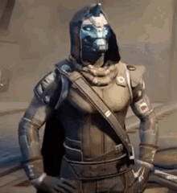

# Teste Implantação FiqOn 

  

 conforme a documentação tomei a liberdade de utilizar o Node.Js e para facilitar testes e o "front do processo" fiz ele rodar em um discord bot usando discord.js, logo seguirei com o processo de instalação e configuração do bot.

## o processo esta separado em 3 partes:

1) [instalação](instalacao.md).
2) [configuração do bot e geração do token](TokenNbot.md).
3) [comandos e utilização](funcionamento.md).

##

fico a disposição para qualquer duvida

Jonas Lang. 

