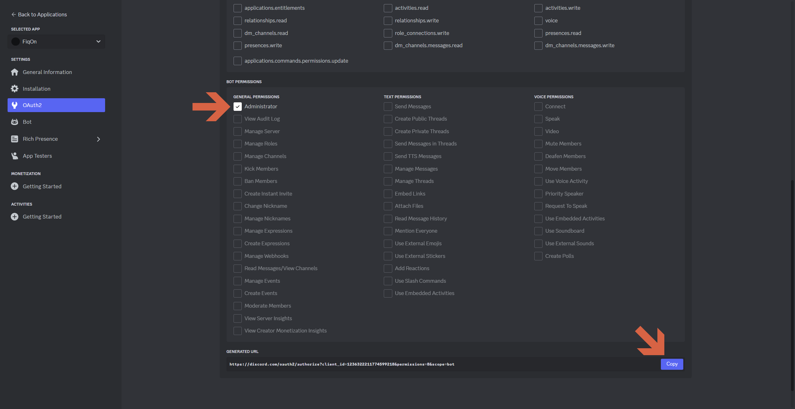

## manual de configuração do bot e bot token

assumindo que ja tenha uma conta dev do discord gere uma nova aplicação e nomeie-a conforme quiser:

após a criação do bot pegue o token dele clicando em reset token:

insira o no arquivo config.json na pasta config:

lembre-se de marcar os intents do bot especialmente a de mensagem.

feito isso convide o bot a uma guilda do discord utilizando o gerador de convites na aba OAuth2

marque a opção bot:

e as permissões neste caso deixei admnistrador, mas pode ser customizado com a necessidade do bot ( nesse caso seria apenas ler e enviar mensagens daria certo )

