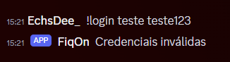
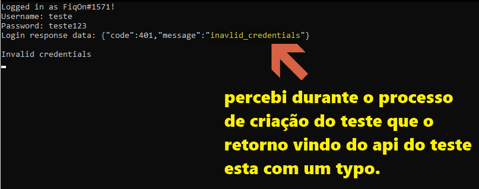
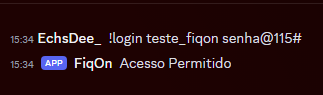
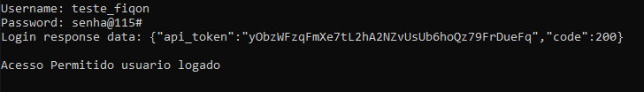
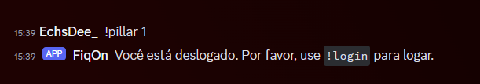
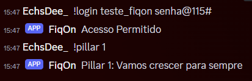
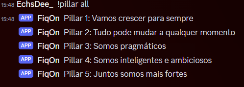
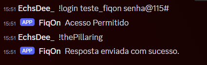
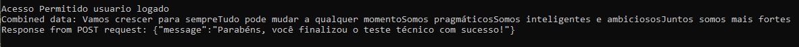

## funcionamento
segue o funcionamento dos commandos.
## 1) comando login: &usuario $senha

informando um login invalido: 

no log deve retornar algo deste tipo:

ao informar o login correto:

retorna acesso permitido

o api token é guardado em uma variavel no codigo para uso nos outros comandos.

## 2) pillar: &numero-do-pilar
o codigo login tem de ser utilizando antes com sucesso:
caso não seja o bot avisa:

após logado:

 pode ser utilizado pillar de 1 a 5 ou informar "all" assim puxa:

 

## 3) The Pillaring:

este comando faz o processo final de gerar o base64 e enviar os pilares e também deve ser rodado após o login.

